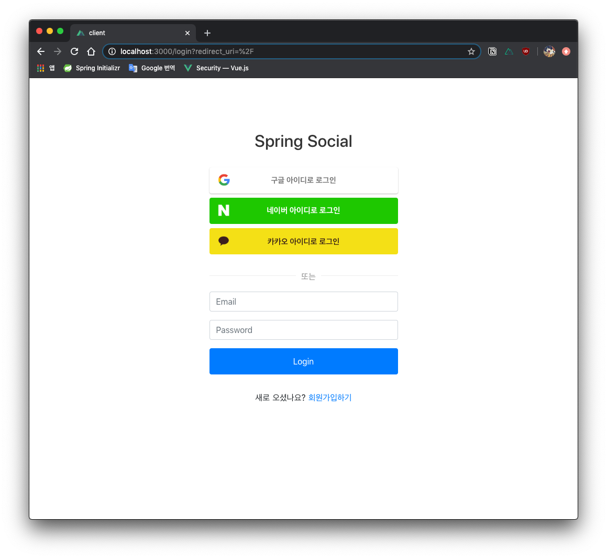
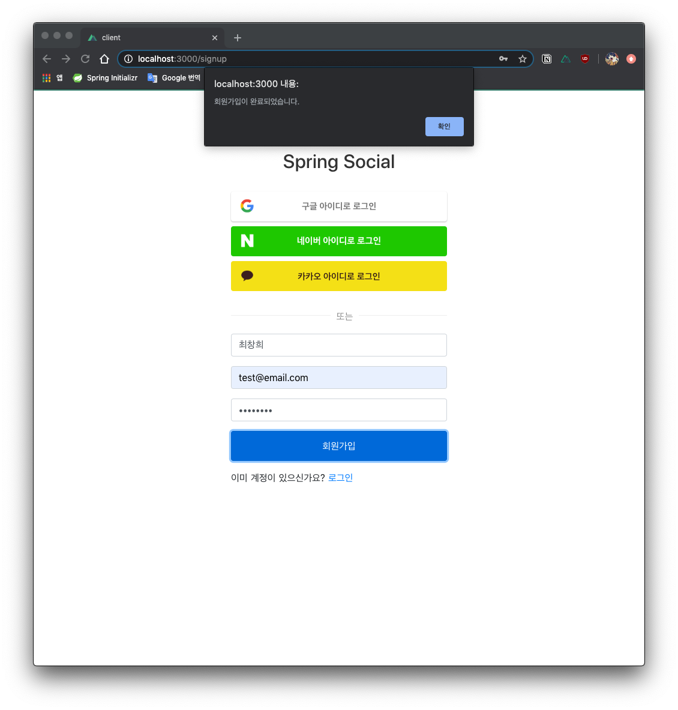
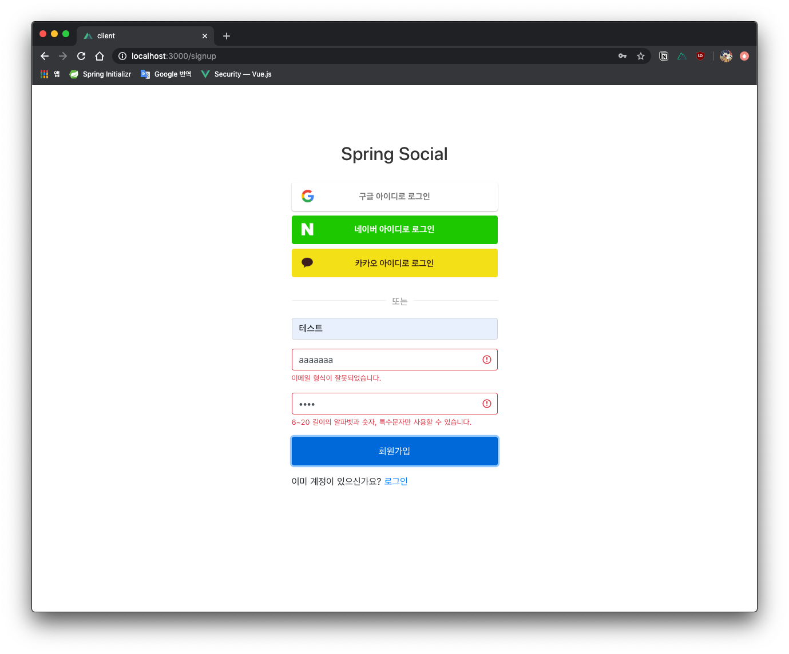

# 유저 관리 기능

### 유저 로그인 및 회원가입

---

#### Spring Security + JWT 토큰을 활용한 인증

로그인 방식에는 크게 세션을 이용한 로그인과 JWT 토큰을 활용한 방식, 두 가지가 있습니다. 해당 프로젝트에서는 토큰을 활용한 로그인 방식을 통해 유저 인증 플로우를 구현할 예정입니다. 참고한 레퍼런스는 다음과 같습니다.
* [SpringBoot + Security + JWT를 이용한 로그인 구현](https://github.com/changheedev/spring-security-jwt-social)

#### 로그인 종류
구성하고자 하는 로그인 종류는 다음과 같습니다.

* 일반 로그인
* 카카오 로그인
* 구글 로그인
* 네이버 로그인

서로 다른 4가지 종류의 로그인 플로우를 최대한 확장성 있게 구현하기 위해서는 디자인 패턴 중 추상 클래스를 활용한 "팩토리 패턴"을 활용할 예정입니다. 또한 applications.yaml 파일에서 소셜 로그인 별로 client_id와 client_secret을 설정하여 필요한 메타 데이터를 도메인 코드에 적절하게 주입합니다.

#### 소셜 로그인 ERD

    

### 접근 권한 관리

---

#### 유저별 권한 관리

해당 서비스는 재고 관리 시스템이기 때문에 경영주와 직원이 접근할 수 있는 URI에 차이가 있어야 합니다. 메뉴와 재고 등록 등의 경우 경영주만 접근할 수 있어야 하며, 재고 조회 등의 URI에는 직원도 접근할 수 있어야 한다. 또한 한 명의 유저가 보유하는 권한이 여러 가지일 수도 있다는 점을 고려했을 때 다음과 같이 데이터베이스를 설계할 수 있습니다.

    

### 구현 화면 예시

---

아래 구현 화면들은 상단에 첨부한 레포지토리로부터 가져왔으며, 기능은 유지하되 디자인은 달라질 예정입니다.

#### 로그인 페이지

#### 회원가입 페이지

> 🎯 회원가입 과정에 이메일 인증을 새롭게 추가할 예정입니다. 

#### 유효성 검증 페이지

